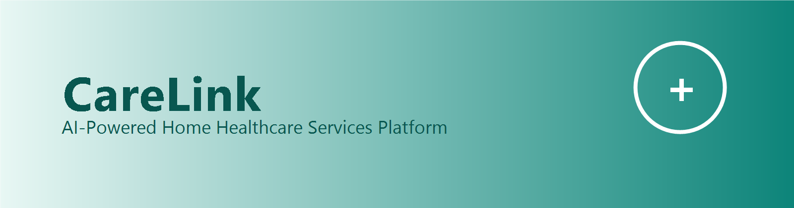
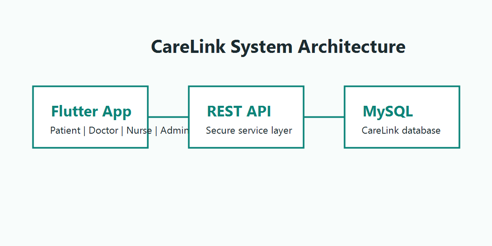

<div align="center">



# CareLink

### Intelligent Home Healthcare Services Platform

CareLink is a graduation project that connects patients with qualified doctors and nurses for reliable home healthcare services, powered by an AI-based provider recommendation system.

<br>


</div>

---

## Project Overview

| Category | Details |
| --- | --- |
| Platform | Home Healthcare Services Platform |
| Backend | Node.js, Express.js |
| Database | MySQL |
| AI Recommendation | AI-powered provider recommendation system |
| User Roles | Patient, Doctor, Nurse, Admin |
| Graduation Project | CareLink |

---

## About

CareLink is a home healthcare services platform designed to connect patients with qualified healthcare providers, including doctors and nurses, for home-based medical care. The platform uses an intelligent recommendation system to help patients find suitable providers based on their health needs, medical information, location, provider availability, ratings, and experience.

The project includes a Flutter mobile application, a Node.js Express backend, and a MySQL database, supporting dedicated workflows for patients, doctors, nurses, and administrators.

---

## Features

<details open>
<summary><strong>Patient</strong></summary>

### Patient

- AI provider recommendation
- Search doctors and nurses
- Book appointments
- Upload medical records
- Messaging
- Appointment history
- Payments
- Ratings

</details>

<details open>
<summary><strong>Doctor</strong></summary>

### Doctor

- Manage appointment requests
- Access patient medical records
- Initial diagnosis reports
- Medical reports
- Visit tracking
- Schedule management
- Earnings

</details>

<details open>
<summary><strong>Nurse</strong></summary>

### Nurse

- Manage home visits
- Visit reports
- Patient communication
- Availability scheduling
- Earnings tracking

</details>

<details open>
<summary><strong>Admin</strong></summary>

### Admin

- Approve healthcare providers
- Manage users
- Set hourly rates
- Dashboard
- Payment monitoring

</details>

---

## AI Recommendation Engine

CareLink includes an AI-powered provider recommendation engine that helps patients discover suitable doctors and nurses for home healthcare services. The recommendation system considers multiple factors to support more relevant provider matching:

| Factor | Description |
| --- | --- |
| Symptoms | Patient health symptoms used for provider matching |
| Medical records | Uploaded medical information used to improve recommendations |
| Location | Patient and provider location for home healthcare access |
| Provider specialty | Doctor or nurse specialty relevant to the patient need |
| Availability | Provider schedule and appointment availability |
| Ratings | Patient ratings and provider feedback |
| Experience | Provider professional experience |

---

## Tech Stack

<div align="center">


</div>

| Layer | Technology |
| --- | --- |
| Mobile Application | Flutter, Dart |
| Backend API | Node.js, Express.js |
| Database | MySQL |
| API Architecture | REST API |
| Version Control | Git, GitHub |

---

## System Architecture

<p align="center">
  
</p>

---

## Project Structure

```text
CareLink/
|-- lib/                 # Flutter application source code
|-- backend/             # Node.js and Express.js backend
|-- assets/              # Application assets
|   `-- readme/          # README visual placeholders
|-- android/             # Android platform files
|-- ios/                 # iOS platform files
`-- test/                # Flutter tests
```

---

## Project Status

🟢 **Graduation Project Completed**

**Version:** 1.0

---

## Security

| Security Feature | Description |
| --- | --- |
| JWT Authentication | Secures authenticated user sessions |
| Password Encryption | Uses bcrypt for password protection |
| Role-Based Authorization | Restricts access based on Patient, Doctor, Nurse, and Admin roles |
| Secure REST APIs | Protects backend communication through structured API access |

---

## Installation

### Clone

```bash
git clone https://github.com/JuliaDuaibes/GraduationProject-CARELINK.git
```

### Backend

```bash
cd backend
npm install
npm start
```

### Flutter

```bash
flutter pub get
flutter run
```

---

## Screenshots

> Screenshots will be added from the actual CareLink application. No fake screenshots are included.

<details open>
<summary><strong>Screenshot placeholders</strong></summary>

| Patient Home | AI Recommendation | Doctor Dashboard |
| --- | --- | --- |
| _Placeholder_ | _Placeholder_ | _Placeholder_ |

| Nurse Dashboard | Admin Dashboard |
| --- | --- |
| _Placeholder_ | _Placeholder_ |

</details>

---

## Future Improvements

- Video consultations
- Push notifications
- AI chatbot
- Electronic prescriptions
- Wearable device integration

---

## Team

| Team Member | Role |
| --- | --- |
| Julia Duaibes | CareLink Team |
| Sara Ahmad | CareLink Team |
| Doina Assi | CareLink Team |

**Supervisor:**  
Dr. Ahmed Abusnaina

---

## License

Educational Use Only

---

## Acknowledgements

The CareLink team would like to thank **Birzeit University** and our project supervisor, **Dr. Ahmed Abusnaina**, for their guidance, support, and academic supervision throughout the development of this graduation project.

---

<div align="center">

Made with ❤️ by the CareLink Team

Birzeit University • 2026

</div>
